# 🧠 RAG Architecture - Deep Dive

> **Comprehensive documentation of the Retrieval-Augmented Generation (RAG) system in AI MATE**

## 📋 Table of Contents

1. [Document Processing Pipeline](#-document-processing-pipeline)
2. [Text Chunking Strategy](#-text-chunking-strategy)
3. [Embedding Models](#-embedding-models)
4. [Vector Storage](#-vector-storage)
5. [Retrieval Mechanisms](#-retrieval-mechanisms)
6. [Context Management](#-context-management)
7. [Reranking \u0026 Scoring](#-reranking--scoring)
8. [Prompts \u0026 Templates](#-prompts--templates)
9. [Query Processing](#-query-processing)
10. [Result Synthesis](#-result-synthesis)
11. [Flow Diagrams](#-flow-diagrams)

---

## 📚 Document Processing Pipeline

### Overview

The document processing pipeline handles 20+ file formats with specialized handling for different content types.

### Supported Formats

| Category | Formats | Libraries |
|----------|---------|-----------|
| **Documents** | PDF, DOCX, PPTX, TXT, MD | PyMuPDF, python-docx, python-pptx |
| **Spreadsheets** | XLSX, XLS, CSV | pandas, openpyxl, xlrd |
| **Images** | PNG, JPG, JPEG, HEIC, HEIF | Pillow, pytesseract (OCR) |
| **Code** | PY, JS, TS, JAVA, C, CPP, GO, etc. | Direct text extraction |
| **Archives** | (Planned future support) | - |

### Key Code Files

```
backend/app/services/document_service.py  # Main document processing
├── _extract_text()                       # Format dispatcher
├── _extract_from_pdf()                   # PDF with OCR + multiprocessing
├── _extract_from_docx()                  # Word documents
├── _extract_from_pptx()                  # PowerPoint
├── _extract_from_xlsx()                  # Excel spreadsheets
└── _create_chunks()                      # Chunking coordinator

backend/app/services/multiprocessing_service.py
├── process_pdf_parallel()                # Parallel PDF processing (>5MB files)
├── process_ocr_images_parallel()         # Parallel OCR for images
└── generate_embeddings_parallel()        # Parallel embedding generation
```

### Processing Libraries Used

- **PyMuPDF** (`fitz`): PDF text extraction with layout preservation
- **pytesseract**: OCR for images and scanned PDFs
- **python-docx**: Microsoft Word document parsing
- **python-pptx**: PowerPoint slide extraction
- **pandas + openpyxl**: Excel file processing (all rows, all sheets)
- **Pillow**: Image manipulation and preprocessing

### Advanced Features

1. **OCR Integration**
   - Automatic fallback to OCR when text extraction fails
   - Table detection in scanned images
   - Support for HEIC/HEIF formats (iOS photos)

2. **Multiprocessing**
   - PDFs >5MB processed in parallel (5-10x faster)
   - Batch OCR processing for multi-page documents
   - Parallel embedding generation for large document sets

3. **Table Structure Preservation**
   - Markdown tables preserved from Excel/Word
   - Cell structure maintained in chunking
   - Special metadata for table content

---

## ✂️ Text Chunking Strategy

### Standard Chunking

**Implementation**: `RecursiveCharacterTextSplitter` from LangChain

```python
# Configuration (from config.py)
chunk_size = 1000          # characters per chunk
chunk_overlap = 200        /# overlap between chunks
```

**Splitting Strategy**:
1. Try to split on paragraphs (`\n\n`)
2. Fallback to sentences (`.`, `!`, `?`)
3. Final fallback to character count

### Table-Aware Chunking

**Implementation**: `TableAwareTextSplitter` (Custom)

```
backend/app/services/document_service.py
└── TableAwareTextSplitter
    ├── _identify_table_sections()     # Detects table markers
    ├── _split_with_table_awareness()  # Preserves table structure
    └── _split_large_table()           # Handles large tables
```

**Features**:
- **Preserves table structure** during chunking
- **2x larger chunks for tables** (2000 chars vs 1000 chars)
- **Header/footer preservation** in split tables
- **Automatic detection** of:
  - ASCII tables (pipe `|`, dashes `-`)
  - CSV-style content
  - Numeric data grids
  - Spreadsheet structure

**Detection Heuristics**:
```python
# Table indicators
- Row separator patterns (---, ===)
- Pipe/bar delimiters (|, ||)
- Keyword matches ("Table", "Column", "Row")
- Numeric data patterns
- Column alignment detection
```

### Format-Specific Chunking

| Format | Strategy | Chunk Size | Special Handling |
|--------|----------|------------|------------------|
| **PDF** | Page-aware | 1000 chars | Preserves page boundaries |
| **Excel** | Row-aware | 2000 chars | All sheets, all rows processed |
| **Word** | Paragraph-aware | 1000 chars | Maintains heading structure |
| **PowerPoint** | Slide-aware | 1000 chars | One slide = one context unit |
| **Code** | Function-aware | 1500 chars |Preserves function boundaries |
| **Markdown** | Section-aware | 1000 chars | Respects heading hierarchy |

---

## 🎯 Embedding Models

### Current Architecture

**Single Unified Embedding Model** for all LLMs (Ollama, Gemini, OpenAI)

```python
# Configuration (config.py)
embedding_provider = "sentence_transformers"
embedding_model = "sentence-transformers/all-mpnet-base-v2"
embedding_device = "cpu"
embedding_batch_size = 32
```

### Why Unified Embeddings?

✅ **Advantages**:
1. **Simplicity**: One vector database, one index
2. **Fast Model Switching**: No re-indexing when changing LLMs
3. **Cost-Effective**: Free local embeddings
4. **Consistency**: Same semantic search regardless of generation model
5. **Storage Efficient**: Single vector database

❌ **Trade-offs**:
- Doesn't leverage model-specific semantic understanding
- Can't utilize Gemini's or OpenAI's embedding APIs

### Embedding Model Details

**all-mpnet-base-v2**:
- **Dimensions**: 768
- **Max Sequence Length**: 384 tokens
- **Performance**: SOTA on semantic search benchmarks
- **Multilingual**: Strong cross-lingual support
- **Speed**: ~1000 sentences/sec on CPU

**Key Code Files**:
```
backend/app/services/vector_service.py
└── VectorService
    ├── _generate_embeddings()          # Sentence Transformers
    └── add_documents()                 # Embedding + storage

backend/app/services/multiprocessing_service.py
└── generate_embeddings_parallel()      # Batch processing
```

---

## 💾 Vector Storage

### Primary Database: ChromaDB

**Implementation**: In-memory + persistent on-disk

```python
# Configuration
chroma_db_path = "./embeddings"
chroma_collection_name = "documents"
```

**ChromaDB Features**:
- **Hybrid Storage**: In-memory cache + disk persistence
- **Metadata Filtering**: Filter by file type, date, tags
- **Multiple Collections**: Separate spaces for different embedding models (future)
- **Distance Metrics**: Cosine similarity (default)

### Storage Structure

```
backend/embeddings/              # ChromaDB storage
├── chroma.sqlite3              # Metadata database
└── [collection_uuid]/          # Vector index files
    ├── data_level0.bin        # HNSW index
    └── length.bin             # Document lengths
```

### Document Metadata Schema

```python
{
    "document_id": "uuid",           # Unique document ID
    "source": "filename.pdf",        # Original filename
    "file_hash": "sha256_hash",      # Content hash  
    "chunk_index": 42,               # Chunk position in document
    "total_chunks": 150,             # Total chunks for this document
    "chunk_id": "hash_chunk_42",     # Unique chunk identifier
    "contains_table": true,          # Table presence flag
    "table_type": "dataframe",       # Type of table
    "row_count": 15,                 # Number of rows (for tables)
    "numeric_data": true,            # Contains numerical data
    "page_num": 5                    # Page number (PDF)
}
```

### Key Code Files

```
backend/app/services/vector_service.py
└── VectorService
    ├── __init__()                      # Initialize ChromaDB client
    ├── add_documents()                 # Store embeddings + metadata
   ├── hybrid_search()                 # Search with metadata filtering
    ├── delete_document_chunks()        # Cleanup
    └── _analyze_chunk_for_tables()     # Table metadata enrichment
```

---

## 🔍 Retrieval Mechanisms

### Multi-Strategy Retrieval System

AI MATE implements a **three-layer retrieval system** with intelligent fallbacks:


### 1. General Semantic Search

**Method**: Cosine similarity in embedding space

```python
# Implementation
vector_service.hybrid_search(
    query=query,
    n_results=10,
    similarity_threshold=0.5
)
```

**Process**:
1. Embed user query using same model as documents
2. Compute cosine similarity with all document vectors
3. Return top-k results above threshold
4. Apply metadata filters if specified

### 2. Table-Aware Search

**Purpose**: Optimized retrieval for tabular/structured content

```python
# Table search with special handling
table_results = hybrid_search_service._search_table_only(
    query=query,
    n_results=5
)
```

**Features**:
- **Metadata Boost**: Higher weight for chunks marked as tables
- **Numerical Query Handling**: Special processing for range queries (e.g., "between 100 and 500")
- **Column Name Matching**: Boost for header/column name matches
- **Structure-Aware Scoring**: Considers row count, column indicators

### 3. Hybrid Search (Documents + Web)

**Coordinator**: `HybridSearchService`

```
backend/app/services/hybrid_search_service.py
└── HybridSearchService
    ├── search_hybrid()                  # Main entry point
    ├── _search_general_only()           # Document search
    ├── _search_table_only()             # Table search
    ├── _combine_and_rerank_results()    # Fusion layer
    └── _deduplicate_results()           # Deduplication
```

**Search Flow**:
```
1. Execute document search (general + table) in parallel
2. Execute web search concurrently
3. Combine results
4. Deduplicate based on text similarity (85% threshold)
5. Rerank by combined score
6. Return top-N results
```

### 4. Web Search Integration

**Providers**:
- **SerpAPI** (Google Search) - Primary
- **Brave Search** - Fallback 1
- **DuckDuckGo** - Fallback 2

```
backend/app/implementations/web_search_agents.py
└── MultiProviderSearchAgent
    ├── search()                        # Main search with fallback
    ├── _search_serpapi()               # Google via SerpAPI
    ├── _search_brave()                 # Brave Search API
    └──_search_duckduckgo()            # DuckDuckGo fallback
```

**Features**:
- Automatic provider fallback on failure
- Query intent analysis
- Recency detection (for time-sensitive queries)
- Authority scoring based on source type

### Retrieval Configuration

```python
# From backend/app/core/config.py
max_search_results = 5          # Top-k documents per query
min_relevance_score = 0.5       # Minimum similarity threshold
search_type = "similarity"      # Distance metric
hybrid_search_alpha = 0.5       # Balance between dense/sparse (if using hybrid)
vector_search_k = 10            # Initial retrieval pool
rerank_top_k = 5                # Final reranked results
use_reranking = True            # Enable reranking layer
```

**Key Code Files**:
```
backend/app/services/document_service.py
└── search_documents()              # Main search endpoint

backend/app/services/chat_service.py
└── _retrieve_context()             # RAG context retrieval
    ├── Document search via document_service
    ├── Web search via ai_service_manager
    └── Result combination and formatting
```

---

## 🧠 Context Management

### Conversation Memory

**Implementation**: `ConversationBufferWindowMemory` from LangChain

```python
# Configuration
max_chat_history = 10           # Maximum messages retained
conversation_memory_type = "buffer_window"
```

### Memory Architecture

```
backend/app/services/chat_service.py
└── ChatService
    ├── conversations: Dict[str, ConversationBufferWindowMemory]
    ├── _get_conversation_memory()      # Get or create memory
    ├── get_conversation_history()      # Retrieve history
    ├── clear_conversation()            # Clear specific conversation
    └── restore_conversation_context()  # Restore from database
```

### Data Structures

**In-Memory Storage**:
```python
conversations = {
    "conversation_id_1": ConversationBufferWindowMemory(k=10),
    "conversation_id_2": ConversationBufferWindowMemory(k=10),
    ...
}
```

**Memory Buffer**:
```python
ConversationBufferWindowMemory(
    k=10,                       # Last 10 message pairs
    memory_key="chat_history",
    return_messages=True
)
```

### Switching Between Conversations

**Process**:
1. **New Conversation**: Frontend generates new UUID
2. **Conversation Switch**: Frontend sends different `conversation_id`
3. **Memory Lookup**: `_get_conversation_memory(conversation_id)` retrieves or creates memory
4. **History Restoration**: Load from database if available
5. **Context Isolation**: Each conversation has independent memory

**Lifecycle**:


### Persistence

**Database**: SQLite (via `DatabaseService`)

```
backend/app/services/database_service.py
└── DatabaseService
    ├── save_conversation()             # Save message pair
    ├── get_conversation_history()      # Load all messages
    └── get_recent_conversations()      # List recent chats
```

**Schema**:
```sql
CREATE TABLE conversations (
    id INTEGER PRIMARY KEY,
    session_id TEXT,              -- conversation_id
    user_message TEXT,
    ai_response TEXT,
    sources JSON,                 -- Retrieved documents
    timestamp DATETIME,
    metadata JSON
);
```

**Key Code Files**:
```
backend/app/services/chat_service.py   # Memory management
backend/app/services/database_service.py  # Persistence
backend/app/api/routes/chat.py        # Conversation endpoints
```

---

## 📊 Reranking \u0026 Scoring

### Reranking Status

**Current Implementation**: ✅ **Enabled** via hybrid scoring

**Method**: Weighted score combination (not cross-encoder reranking yet)

### Scoring Strategy

```python
# Hybrid score calculation
final_score = (
    relevance_score +
    (authority_score * quality_weight) +
    (recency_score * recency_weight)
)
```

### Score Components

1. **Relevance Score** (0.0 - 1.0)
   - Cosine similarity from vector search
   - Primary ranking signal

2. **Authority Score** (0.0 - 1.0)
   - Web source credibility
   - Domain reputation
   - Content quality indicators

3. **Recency Score** (0.0 - 1.0)
   - Time-based boost for recent content
   - Activated for time-sensitive queries

4. **Table Boost** (+0.1 - +0.3)
   - Extra weighting for table-containing chunks
   - Applied when query has numerical/tabular intent

### Deduplication

**Method**: Text similarity threshold

```python
similarity_threshold = 0.85  # 85% text overlap

def _deduplicate_results(results):
    for result in results:
        similarity = compute_similarity(result.text, existing.text)
        if similarity \u003e threshold:
            # Keep higher-scoring result
            ...
```

### Future: ColBERT Reranking

**Planned Implementation** (Phase 2):

```
backend/app/implementations/precise_retrievers.py
└── ColBERTImplementation
    └── search_precise()           # Token-level matching
```

**ColBERT Advantages**:
- Token-level late interaction
- 5x faster than cross-encoders
- Better table cell matching
- Contextual matching within tables

**Key Code Files**:
```
backend/app/services/hybrid_search_service.py
└── _combine_and_rerank_results()   # Current reranking

backend/app/implementations/result_fusion.py
└── IntelligentResultFusion           # Web + doc fusion
    ├── rank_results()                # Contextual ranking
    └── _ensure_source_diversity()    # Diversity injection
```

---

## 💬 Prompts \u0026 Templates

### Prompt Types

AI MATE uses **dynamic prompt selection** based on search mode and context:

```
backend/app/core/prompts.py          # All prompt templates
├── get_system_prompt()              # No RAG context
├── get_rag_prompt()                 # Standard RAG
├── get_web_only_prompt()            # Web search only
├── get_hybrid_synthesis_prompt()    # Intelligent fusion
└── get_search_prompt()              # Query expansion
```

### 1. Standard RAG Prompt

**Used when**: Documents-only or hybrid mode without relevancy

```python
get_rag_prompt()
```

**Key Instructions**:
- Prioritize retrieved context over internal knowledge
- Cite sources (documents and web)
- Distinguish between document and web sources
- Use markdown formatting
- **Don't hallucinate** - say "I don't know" if uncertain

### 2. Web-Only Prompt

**Used when**: Web search mode selected

```python
get_web_only_prompt()
```

**Critical Instructions**:
- **ONLY use web search results** (completely ignore documents)
- **Explicitly forbidden** from using internal knowledge
- Must cite all web sources with URLs
- If no web results: state "no information found from web sources"

**Example Response Requirement**:
```markdown
Based ONLY on web sources:
[Answer using only web search results]

Sources:
- [Web Title](URL)
- [Another Source](URL)
```

### 3. Hybrid Synthesis Prompt

**Used when**: Relevancy detected between documents and web sources

```python
get_hybrid_synthesis_prompt()
```

**Synthesis Instructions**:
- **Merge related information** from both sources
- Use documents as authoritative base
- Enhance with web sources for updates/context
- Create cohesive narrative
- On conflicts: prioritize documents

**Example Synthesis**:
```markdown
# Topic Overview
[Synthesized from document + web]:
According to the internal documentation, Feature X includes... 
Recent updates from [Web Source] indicate that...

Combined, this means...
```

### Prompt Selection Logic

```python
# In chat_service.py: _build_chat_prompt()

if context_docs:
    if search_mode == "web":
        prompt = get_web_only_prompt()
    elif search_mode == "hybrid":
        has_relevancy = _detect_relevancy(context_docs)
        if has_relevancy:
            prompt = get_hybrid_synthesis_prompt()  # Merge sources
        else:
            prompt = get_rag_prompt()               # List separately
    else:
        prompt = get_rag_prompt()
else:
    if search_mode == "web":
        prompt = get_web_only_prompt()              # "No web results found"
    else:
        prompt = get_system_prompt()                # No context at all
```

### Relevancy Detection

**Method**: Keyword overlap + entity matching

```python
# backend/app/services/chat_service.py
def _detect_relevancy(context_docs) -\u003e bool:
    # Separate doc vs web sources
    # Extract keywords from each
    # Compute overlap percentage
    # Check for common entities (names, topics)
    
    is_relevant = (
        avg_keyword_overlap \u003e 0.12 or        # 12% keyword overlap
        entity_match_ratio \u003e 0.30            # 30% entity matches
    )
    return is_relevant
```

### Context Formatting

**Structure**:
```markdown
Context Information:

📄 **Document Sources:**
- Document Source 1: [filename]
- Document Source 2: [filename]

🌐 **Web Sources:**
- Web Source 1: [Title](URL) 🆕
- Web Source 2: [Title](URL)

---

### Document Source 1 - filename.pdf
[chunk text...]

### Web Source 1 - Article Title
[web content...]
```

---

## 🔄 Query Processing

### Query Transformation Pipeline

AI MATE performs **minimal query transformation** to preserve user intent:


### Query Analysis Features

```
backend/app/implementations/query_analysis.py
└── QueryAnalyzer
    ├── analyze_query()                 # Main analysis
    ├── _detect_intent()                # Query type
    ├── _extract_entities()             # Named entities
    ├── _detect_temporal_aspects()      # Time sensitivity
    └── _analyze_complexity()           # Query complexity
```

**Detected Attributes**:
```python
{
    "intent": "factual_lookup | comparison | latest_info | ...",
    "entity_types": ["person", "organization", "location"],
    "requires_latest": bool,              # Needs recent data
    "temporal_keywords": ["recent", "latest", "2024"],
    "complexity": "simple | moderate | complex",
    "filters": {
        "preferred_source_types": ["news", "academic"],
        "date_range": "last_30_days"
    }
}
```

### Query Expansion

**Status**: ❌ **Not Currently Implemented**

**Planned Approach** (Future):
```python
expanded_query = llm.generate(
    prompt=get_search_prompt().format(query=original_query)
)
# Returns: alternative phrasings, synonyms, related terms
```

**Current Behavior**: Queries are used **as-is** without expansion

### No Query Rewriting

**Design Decision**: Preserve user's original question

**Rationale**:
- Maintains user intent accuracy
- Avoids semantic drift
- Faster retrieval (no LLM call needed)
- Better for technical/precise queries

**Example**:
```
User query: "What is the revenue for Q4 2023?"
✅ Search: "What is the revenue for Q4 2023?"
❌ NOT expanded to: "fourth quarter 2023 financial revenue income earnings"
```

### Web Search Query Processing

**Enhancement**: Provider-specific formatting

```python
# SerpAPI (Google)
formatted_query = f"{query} site:specific-domain.com"  # If filter applied

# Brave Search
# Direct query, no modification

# DuckDuckGo
# Direct query with fallback logic
```

**Key Code Files**:
```
backend/app/implementations/query_analysis.py      # Query analysis
backend/app/implementations/web_search_agents.py   # Web search execution
backend/app/services/chat_service.py               # Query → Retrieval
```

---

## 🎭 Result Synthesis

### Synthesis Modes

AI MATE has **three distinct synthesis strategies**:

### 1. Documents-Only Mode

**Behavior**: Standard RAG

```python
# Prompt: get_rag_prompt()
# Context: Only document chunks
# Synthesis: List document sources separately
```

**Output Structure**:
```markdown
Based on the uploaded documents:

[Answer using document sources]

**Sources:**
- Document 1: filename.pdf
- Document 2: report.docx
```

### 2. Web-Only Mode

**Behavior**: Pure web search (ignores documents)

```python
# Prompt: get_web_only_prompt()
# Context: Only web search results
# Synthesis: Cannot mention documents
```

**Output Structure**:
```markdown
Based on web sources:

[Answer using only web results]

**Sources:**
- [Article Title](https://example.com)
- [News Source](https://news.com)
```

**Special Case** - No Web Results:
```markdown
I couldn't find any information from web sources about this topic. 
The web search didn't return any relevant results.
```

### 3. Hybrid Mode (Intelligent Synthesis)

**Two Sub-Modes**:

#### A) **No Relevancy Detected**
```python
# Prompt: get_rag_prompt()
# Synthesis: List sources separately
```

**Output**:
```markdown
# From Documents
[Document-based information]

Sources: filename.pdf

# From Web
[Web-based information]

Sources: [Article](URL)
```

#### B) **Relevancy Detected**
```python
# Prompt: get_hybrid_synthesis_prompt()
# Synthesis: Merge related information
```

**Output**:
```markdown
# Combined Analysis

According to the internal documentation (filename.pdf), 
Feature X includes components A, B, and C. 

Recent updates from [Tech Blog](URL) indicate that 
version 2.0 added component D, extending the original 
capabilities described in the documentation.

This enhancement means...

**Sources:**
- Internal: filename.pdf  
- Web: [Tech Blog](URL)
```

### Relevancy Detection Algorithm

```python
def _detect_relevancy(document_chunks, web_chunks) -\u003e bool:
    # Extract keywords from both source types
    doc_keywords = extract_keywords(document_chunks)
    web_keywords = extract_keywords(web_chunks)
    
    # Compute keyword overlap
    overlap = len(doc_keywords ∩ web_keywords) / len(doc_keywords ∪ web_keywords)
    
    # Extract entities (names, orgs, locations)
    doc_entities = extract_entities(document_chunks)
    web_entities = extract_entities(web_chunks)
    
    entity_match_ratio = count_matching_entities / total_web_entities
    
    # Threshold-based decision
    return (
        overlap \u003e 0.12 or              # 12% keyword overlap
        entity_match_ratio \u003e 0.30       # 30% shared entities
    )
```

**Example Triggering Relevancy**:
```
Documents: "John Smith is CEO of TechCorp"
Web: "John Smith announced new product from TechCorp"
→ Shared entities: "John Smith", "TechCorp"
→ Relevancy = TRUE → Use synthesis prompt
```

### Source Prioritization

**Conflict Resolution**:
```python
if document_source.info != web_source.info:
    # Priority order:
    1. Use document source as primary/authoritative
    2. Note web source as "recent update" or "alternative view"
    3. Explicitly state conflict if significant
```

**Example Conflict**:
```markdown
The internal documentation states the feature was released in 2023.
However, recent web sources ([Source](URL)) indicate a delayed 
release in early 2024. 

Per the authoritative internal documentation, the planned release 
was 2023, though external reports suggest a later timeline.
```

### Web-Only Mode Enforcement

**Strict Isolation**:
```python
# In web_only_prompt:
- "Do NOT use uploaded documents"
- "If documents mentioned, ignore completely"
- "Use ONLY web search results"
- "If no web results: explicitly state 'no web information found'"
```

**This prevents**:
```
❌ "Based on your documents and web sources..."
✅ "Based ONLY on web sources..." (correct)

❌ "The document mentions... and web says..."
✅ "No web results found for this topic." (if web search empty)
```

### Chat History Inclusion

**All Modes Include Chat History**:
```python
prompt = template.format(
    context=relevant_docs,
    chat_history=last_10_messages,
    question=user_query
)
```

**Web-Only Mode Behavior**:
- ✅ Includes previous conversation messages
- ❌ Does NOT include document context
- ✅ Can reference prior messages for continuity

**Example**:
```
User: "What's the weather in Paris?" (web search)
AI: [web results about Paris weather]

User: "What about London?"
AI: [uses chat history to understand "London weather" + new web search]
```

**Key Code Files**:
```
backend/app/services/chat_service.py
└── _build_chat_prompt()
    ├── _detect_relevancy()              # Decide synthesis mode
    ├── Prompt selection logic
    └── Context formatting

backend/app/core/prompts.py
├── get_web_only_prompt()                # Strict web-only
├── get_rag_prompt()                     # Standard docs
└── get_hybrid_synthesis_prompt()        # Intelligent merging
```

---

## 📊 Flow Diagrams

### 1. Document Upload to Vector Store


### 2. User Query → Response Generation

```mermaid
flowchart TB
    Query([User Sends Query]) --> Mode{Search Mode?}
    
    Mode -->|Documents Only| DocMode[Documents Mode]
    Mode -->|Web Only| WebMode[Web Mode]
    Mode -->|Hybrid| HybridMode[Hybrid Mode]
    
    %% Documents Only Path
    DocMode --> EmbedQ1[Embed Query<br/>all-mpnet-base-v2]
    EmbedQ1 --> VectorSearch[Vector Search<br/>ChromaDB]
    VectorSearch --> GeneralSearch[General<br/>Semantic Search]
    VectorSearch --> TableSearch[Table-Aware<br/>Search]
    GeneralSearch --> Combine1[Combine<br/>Results]
    TableSearch --> Combine1
    Combine1 --> Filter1[Filter by<br/>Similarity \u003e 0.5]
    Filter1 --> TopK1[Top-10<br/>Results]
    TopK1 --> Dedup1[Deduplicate<br/>85% Threshold]
    Dedup1 --> Rerank1[Rerank by<br/>Score]
    Rerank1 --> DocContext[Document<br/>Context]
    DocContext --> BuildPrompt1[Build Prompt]
    
    %% Web Only Path
    WebMode --> AnalyzeIntent[Analyze Query<br/>Intent Detection]
    AnalyzeIntent --> WebProvider{Select<br/>Provider}
    WebProvider -->|Primary| Serp[SerpAPI<br/>Google Search]
    WebProvider -->|Fallback #1| Brave[Brave Search]
    WebProvider -->|Fallback #2| Duck[DuckDuckGo]
    Serp --> WebResults[Web Results]
    Brave --> WebResults
    Duck --> WebResults
    WebResults --> ScoreWeb[Score \u0026 Rank<br/>Relevance + Authority]
    ScoreWeb --> TopWeb[Top-10<br/>Web Results]
    TopWeb --> WebContext[Web Context<br/>ONLY]
    WebContext --> BuildPrompt2[Build Prompt<br/>get_web_only_prompt]
    
    %% Hybrid Path
    HybridMode --> ParallelSearch{{Parallel Execution}}
    ParallelSearch --> DocSearch2[Document Search<br/>Same as above]
    ParallelSearch --> WebSearch2[Web Search<br/>Same as above]
    DocSearch2 --> DocRes[Doc Results]
    WebSearch2 --> WebRes[Web Results]
    DocRes --> Fusion[Result Fusion]
    WebRes --> Fusion
    Fusion --> DedupHybrid[Deduplicate<br/>Cross-Source]
    DedupHybrid --> RerankHybrid[Weighted<br/>Reranking]
    RerankHybrid --> TopHybrid[Top-10<br/>Combined]
    TopHybrid --> DetectRel{Detect<br/>Relevancy?}
    DetectRel -->|Yes| SynthContext[Synthesis<br/>Context]
    DetectRel -->|No| SeparateContext[Separate<br/>Context]
    SynthContext --> BuildPrompt3[Build Prompt<br/>get_hybrid_synthesis_prompt]
    SeparateContext --> BuildPrompt3Alt[Build Prompt<br/>get_rag_prompt]
    
    %% Prompt Building
    BuildPrompt1 --> Memory[Load Conversation<br/>Memory]
    BuildPrompt2 --> Memory
    BuildPrompt3 --> Memory
    BuildPrompt3Alt --> Memory
    
    Memory --> FormatContext[Format Context<br/>+ History + Query]
    FormatContext --> SelectLLM{Model<br/>Provider?}
    
    %% LLM Selection
    SelectLLM -->|Ollama| LLMOllama[Initialize<br/>ChatOllama]
    SelectLLM -->|Gemini| LLMGemini[Initialize<br/>GeminiLLM]
    SelectLLM -->|OpenAI| LLMOpenAI[Initialize<br/>ChatOpenAI]
    
    LLMOllama --> CheckInterface{LLM<br/>Interface?}
    LLMGemini --> CheckInterface
    LLMOpenAI --> CheckInterface
    
    CheckInterface -->|LangChain| UseAinvoke[Use ainvoke/<br/>astream]
    CheckInterface -->|Custom| UseGenerate[Use generate/<br/>generate_stream]
    
    %% Generation
    UseAinvoke --> Stream{Streaming?}
    UseGenerate --> Stream
    Stream -->|Yes| StreamGen[Stream Response<br/>Chunk by Chunk]
    Stream -->|No| FullGen[Generate Full<br/>Response]
    
    StreamGen --> UpdateMem[Update Memory<br/>+ Save to DB]
    FullGen --> UpdateMem
    
    UpdateMem --> Response([✅ Send Response<br/>to User])
    
    style Query fill:#e1f5e1
    style Response fill:#e1f5e1
    style ParallelSearch fill:#fff3cd
    style Fusion fill:#d4edff
    style DetectRel fill:#ffe4c4
```



### 3. Retrieval → Reranking → Context Building → Prompt → Generation


---

## 🎓 Key Takeaways

### Architecture Highlights

1. **Unified Embeddings**: Same model (all-mpnet-base-v2) for all LLMs → fast model switching
2. **Table-Aware Processing**: Special chunking, metadata, and retrieval for tabular content
3. **Three-Mode Search**: Isolated document/web/hybrid modes with strict enforcement
4. **Intelligent Synthesis**: Automatic merging when document \u0026 web sources are relevant
5. **No Query Rewriting**: Preserves user intent by using original queries
6. **Weighted Reranking**: Score fusion (relevance + authority + recency) instead of cross-encoders
7. **Conversation Isolation**: Each chat has independent memory and history
8. **Dynamic Prompts**: Context-aware prompt selection based on search mode and relevancy

### Performance Characteristics

| Operation | Performance | Optimization |
|-----------|-------------|--------------|
| **PDF Processing** | 5-10x faster (large files) | Multiprocessing |
| **Embedding Generation** | ~1000 sentences/sec | Batch processing + parallelization |
| **Vector Search** | \u003c 100ms (10k docs) | HNSW index (ChromaDB) |
| **Web Search** | 1-3 seconds | Provider fallback + caching |
| **Reranking** | \u003c 50ms | Weighted scoring (no cross-encoder) |
| **LLM Generation** | 10-50 tokens/sec | Streaming responses |

### Future Enhancements

- [ ] **ColBERT Reranking**: Token-level matching for tables (5x faster than cross-encoders)
- [ ] **Query Expansion**: LLM-based query enhancement
- [ ] **Model-Specific Embeddings**: Separate indexes for Gemini/OpenAI embeddings
- [ ] **Cross-Encoder Reranking**: Increase precision for top-10 results
- [ ] **Hybrid Vector + BM25**: Lexical + semantic fusion
- [ ] **Citation Tracking**: Fine-grained source attribution per sentence

---

## 📚 Reference Code Files

### Primary Files

| Component | File | Key Functions |
|-----------|------|---------------|
| **Document Processing** | `backend/app/services/document_service.py` | `_extract_text`, `_create_chunks` |
| **Chunking** | `backend/app/services/document_service.py` | `TableAwareTextSplitter` |
| **Embeddings** | `backend/app/services/vector_service.py` | `_generate_embeddings`, `add_documents` |
| **Vector Storage** | `backend/app/services/vector_service.py` | `VectorService.__init__` |
| **Retrieval** | `backend/app/services/hybrid_search_service.py` | `search_hybrid` |
| **Reranking** | `backend/app/implementations/result_fusion.py` | `rank_results` |
| **Context Building** | `backend/app/services/chat_service.py` | `_build_chat_prompt` |
| **Memory** | `backend/app/services/chat_service.py` | `_get_conversation_memory` |
| **Prompts** | `backend/app/core/prompts.py` | All `get_*_prompt()` functions |
| **LLM Integration** | `backend/app/services/chat_service.py` | `_generate_response`, `_get_llm_for_provider` |
| **Web Search** | `backend/app/implementations/web_search_agents.py` | `MultiProviderSearchAgent` |
| **Database** | `backend/app/services/database_service.py` | `save_conversation` |

---

**Last Updated**: January 21, 2025  
**Version**: AI MATE v1.0  
**Author**: System Architecture Documentation
