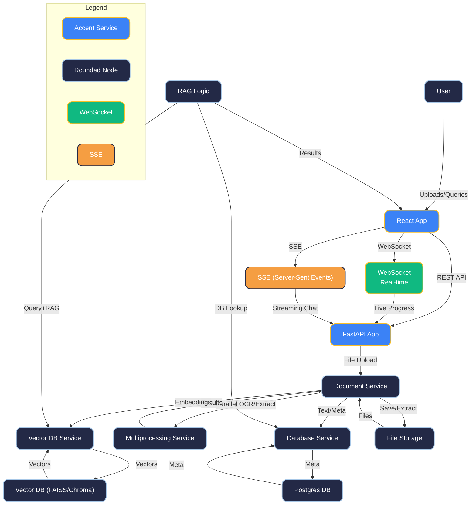
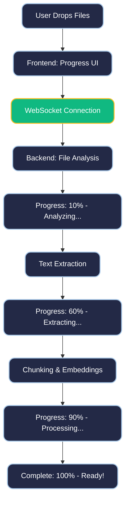
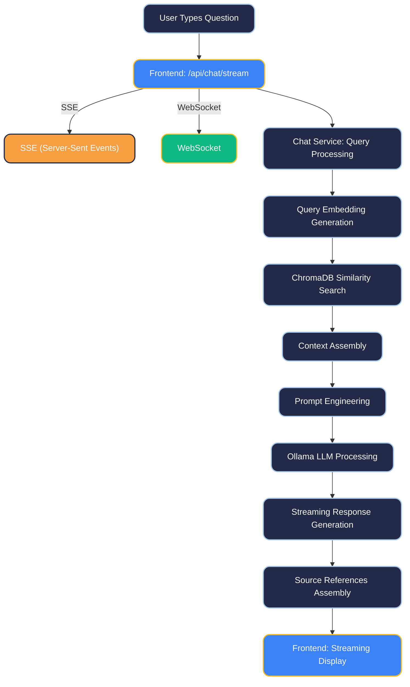

# 🤖 AI MATE - Intelligent Document Chatbot

[](https://python.org) [](https://reactjs.org) [](https://fastapi.tiangolo.com)
[](https://ollama.ai)

---

## 🏗️ Architecture Diagram



---

## 🌟 Features

- Advanced document processing (PDF, DOCX, PPTX, XLSX, PNG, JPG, HEIC, code/text/markdown)
- OCR and parallel processing for large/scanned files
- Duplicate prevention, real-time progress, and enhanced metadata
- RAG (Retrieval Augmented Generation) with local AI (Ollama)
- Modern, responsive UI/UX with live status and preview
- Privacy-first: all processing is local, no external APIs

---

## 📄 Flow Diagrams

### Real-Time Upload Progress


### RAG Chat Flow


---

## 🧠 Architecture Explanation

- **Layered, service-oriented backend** (FastAPI, async, multiprocessing)
- **Frontend**: React, real-time WebSocket progress, modern UI
- **Document Service**: Handles all file types, duplicate detection, conversion, text extraction, chunking
- **Parallel Processing**: Large files and OCR handled in parallel using all CPU cores
- **RAG Logic**: Query embedding, vector search, context assembly, prompt engineering, LLM response, streaming output
- **Databases**: ChromaDB (vectors), SQLite (metadata), file storage (originals, converted)

---

## 📦 File Handling & Parallel Processing

- **Validation**: File type, size, and duplicate check (SHA256 hash)
- **Conversion**: Auto-PDF for office, PNG for HEIC, direct text for code/markdown
- **Extraction**: Text extraction with fallback to OCR for images/scanned PDFs
- **Parallelism**: Large files split and processed in parallel, with real-time progress
- **Stages**: Validation → Duplicate → Conversion → Extraction → Chunking → Embeddings → Storage

---

## 🧩 File Processing Stages & Embeddings

- **Stage 1**: Validation & duplicate detection
- **Stage 2**: Conversion (PDF, PNG, etc.)
- **Stage 3**: Text extraction (direct or OCR)
- **Stage 4**: Chunking (semantic splitting)
- **Stage 5**: Embedding generation (ChromaDB)
- **Stage 6**: Metadata and file storage

---

## 🔍 How RAG Works

- **User Query** → Embedded (vector)
- **Vector Search** → Top-K relevant chunks from ChromaDB
- **Context Assembly** → Relevant text + metadata
- **Prompt Engineering** → RAG context + user query
- **LLM (Ollama)** → Generates answer, streams to frontend
- **Source Attribution** → Shows which docs were used

---

## 🗄️ Databases

- **ChromaDB**: Vector storage for embeddings
- **SQLite**: Metadata for files, conversations, sessions
- **File Storage**: Originals, converted files, and extracted text

---

## 🛠️ REST API Endpoints

- `POST /api/upload` — Upload a document
- `GET /api/documents` — List all uploaded documents
- `GET /api/documents/{id}` — Get document details
- `DELETE /api/documents/{id}` — Delete a document
- `POST /api/chat/stream` — Start a chat with RAG
- `GET /api/status` — System status (backend, AI models)
- `POST /api/admin/reset` — Reset/clean system
- (See backend code for full OpenAPI schema)

---

## 🧪 Test Scripts

- **Comprehensive test suite**: `backend/tests/test_comprehensive_system.py`
- **Test runner**: `backend/tests/run_tests.sh`
- **Test data**: `test_data/` folder with real files
- **Performance metrics**: Throughput, memory, parallelism
- **How to run**:
  ```bash
  cd backend
  ./tests/run_tests.sh
  # or
  python tests/test_comprehensive_system.py
  ```
- **View results**:
  ```bash
  python scripts/display_test_report.py
  ```

---

## 🧹 Reset/Cleaning Scripts

- **cleanup_system.sh**: Safely wipes all data except .env and venv
- **reset_system_complete.sh**: Legacy, full system reset
- **display_test_report.py**: Beautiful test report viewer
- **How to use**:
  ```bash
  cd backend
  ./scripts/cleanup_system.sh --force
  # or
  ./scripts/reset_system_complete.sh
  ```

---

## 🚀 Project Setup

### Prerequisites
- Python 3.13+
- Node.js 18+
- Ollama (for local AI)

### 1. Setup Ollama & AI Models
```bash
brew install ollama
ollama serve
ollama pull llama3:8b-instruct-q8_0
```

### 2. Backend Setup
```bash
git clone <repository-url>
cd chatbot/backend
python -m venv venv
source venv/bin/activate
pip install -r requirements.txt
uvicorn app.main:app --reload
```

### 3. Frontend Setup
```bash
cd ../frontend
npm install
npm start
```

---