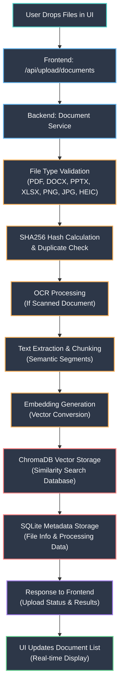
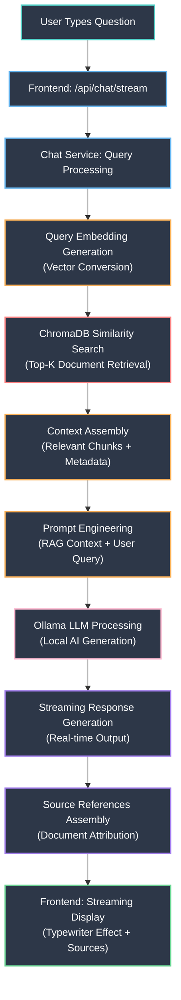
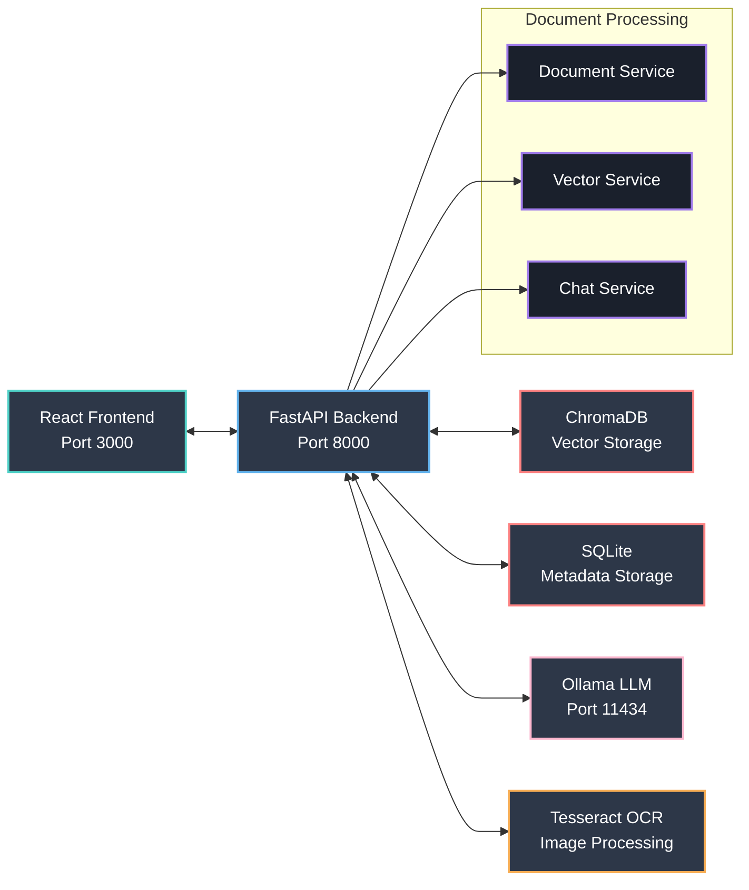

# 🤖 AI MATE - Intelligent Document Chatbot

[](https://python.org)
[](https://reactjs.org)
[](https://fastapi.tiangolo.com)
[](https://ollama.ai)

A powerful AI-powered document chatbot with **Retrieval Augmented Generation (RAG)** capabilities. Upload documents and have intelligent conversations about their content using local AI models for complete privacy.

## 🌟 Features

### 📄 **Advanced Document Processing**
- **Supported Formats**: PDF, DOCX, PPTX, XLSX, PNG, JPG, HEIC
- **OCR Support**: Automatic text extraction from scanned documents and images
- **Duplicate Prevention**: SHA256 file hashing prevents duplicate uploads
- **Enhanced Metadata**: File size, upload time, processing strategy tracking
- **File Validation**: Type-specific validation and error handling

### 🧠 **Intelligent RAG System**
- **Vector Search**: Semantic similarity search using ChromaDB
- **Context Retrieval**: Automatically finds relevant document chunks
- **Source References**: Shows which documents were used in responses
- **Streaming Responses**: Real-time chat with typewriter effect
- **Multi-Document Support**: Query across all uploaded documents

### 🚀 **Modern UI/UX**
- **Three-Panel Layout**: File upload, chat interface, conversation history
- **Real-Time Processing**: WebSocket-based upload progress tracking
- **Document Details**: Enhanced file information display with icons
- **Console Logging**: Live processing logs with toggle visibility
- **Responsive Design**: Works on desktop and mobile devices

### 🔒 **Privacy-First Architecture**
- **Local AI Models**: Uses Ollama for complete data privacy
- **No External APIs**: All processing happens on your machine
- **Secure Storage**: Local SQLite and ChromaDB storage

## 🏗️ Architecture

### **Document Upload & Processing Flow**


### **RAG Chat Flow**


### **System Component Interaction**



## 🚀 Quick Start

### Prerequisites

- **Python 3.13+**
- **Node.js 18+**
- **Ollama** (for AI models)

### 1. Setup Ollama & AI Models

```bash
# Install Ollama (macOS)
brew install ollama

# Start Ollama service
ollama serve

# Pull the required model
ollama pull llama3:8b-instruct-q8_0
```

### 2. Clone & Setup Backend

```bash
# Clone repository
git clone <repository-url>
cd chatbot

# Setup Python virtual environment
cd backend
python -m venv venv
source venv/bin/activate  # On Windows: venv\Scripts\activate

# Install dependencies
pip install -r requirements.txt

# Start backend server
uvicorn app.main:app --reload --host 0.0.0.0 --port 8000
```

### 3. Setup Frontend

```bash
# In a new terminal
cd frontend

# Install dependencies
npm install

# Start React development server
npm start
```

### 4. Access Application

- **Frontend**: http://localhost:3000
- **Backend API**: http://localhost:8000
- **API Documentation**: http://localhost:8000/docs

## 📁 Project Structure

```
chatbot/
├── backend/                 # FastAPI Python backend
│   ├── app/
│   │   ├── api/routes/     # API endpoints
│   │   │   ├── chat.py     # RAG chat endpoints
│   │   │   ├── documents.py # Document management
│   │   │   ├── upload.py   # File upload handling
│   │   │   └── admin.py    # System administration
│   │   ├── services/       # Core business logic
│   │   │   ├── chat_service.py      # RAG chat logic
│   │   │   ├── document_service.py  # Document processing
│   │   │   ├── vector_service.py    # ChromaDB operations
│   │   │   └── database_service.py  # SQLite operations
│   │   ├── core/
│   │   │   ├── config.py   # Configuration management
│   │   │   └── prompts.py  # AI prompt templates
│   │   └── main.py         # FastAPI application
│   ├── data/               # SQLite database storage
│   ├── embeddings/         # ChromaDB vector storage
│   └── requirements.txt    # Python dependencies
├── frontend/               # React TypeScript frontend
│   ├── src/
│   │   ├── components/     # React components
│   │   │   ├── ChatPanel.tsx        # Chat interface
│   │   │   ├── FileUploadPanel.tsx  # File upload & management
│   │   │   ├── ConversationPanel.tsx # Chat history
│   │   │   ├── StatusPanel.tsx      # System status
│   │   │   ├── Console.tsx          # Processing logs
│   │   │   ├── DocumentDetails.tsx  # Document information
│   │   │   ├── DocumentPreview.tsx  # Document viewer
│   │   │   └── DocumentSources.tsx  # RAG source display
│   │   ├── styles/         # Styled components
│   │   └── App.tsx         # Main application
│   └── package.json        # Node.js dependencies
└── README.md              # This file
```

## 🔧 Configuration

### Backend Configuration

Create `.env` file in the `backend/` directory:

```env
# AI Model Configuration
LLM_PROVIDER=ollama
OLLAMA_MODEL=llama3:8b-instruct-q8_0
OLLAMA_BASE_URL=http://localhost:11434

# Document Processing
MAX_FILE_SIZE_MB=500
ENABLE_OCR=true
ENABLE_PARALLEL_PROCESSING=true

# Database
DATABASE_URL=sqlite:///./data/chatbot.db
VECTOR_DB_PATH=./embeddings

# API Configuration
CORS_ORIGINS=["http://localhost:3000"]
```

### Frontend Configuration

Update `frontend/src/App.tsx` if needed:

```typescript
const BACKEND_URL = 'http://localhost:8000';
```

## 📚 API Documentation

### Document Management

| Method | Endpoint | Description |
|--------|----------|-------------|
| `GET` | `/api/documents/` | List all documents with metadata |
| `GET` | `/api/documents/{id}` | Get specific document details |
| `GET` | `/api/documents/{id}/preview` | Preview document content |
| `DELETE` | `/api/documents/{id}` | Delete document |
| `GET` | `/api/documents/search?q=query` | Search in documents |

### File Upload

| Method | Endpoint | Description |
|--------|----------|-------------|
| `POST` | `/api/upload/documents` | Upload multiple files |
| `GET` | `/api/upload/status/{id}` | Get upload progress |
| `GET` | `/api/upload/history` | Upload history |

### RAG Chat

| Method | Endpoint | Description |
|--------|----------|-------------|
| `POST` | `/api/chat` | Send message with RAG context |
| `POST` | `/api/chat/stream` | Streaming chat responses |
| `GET` | `/api/chat/history/{id}` | Conversation history |

### System Administration

| Method | Endpoint | Description |
|--------|----------|-------------|
| `GET` | `/api/admin/status` | System health check |
| `POST` | `/api/admin/reset` | Reset system data |
| `GET` | `/health` | Health check endpoint |

## 🛠️ Development

### Running Tests

```bash
# Backend tests
cd backend
python scripts/run_comprehensive_tests.py

# Frontend tests
cd frontend
npm test
```

### Building for Production

```bash
# Build frontend
cd frontend
npm run build

# Backend production setup
cd backend
pip install gunicorn
gunicorn app.main:app --host 0.0.0.0 --port 8000
```

### Adding New Document Types

1. Update `ALLOWED_EXTENSIONS` in `backend/app/core/config.py`
2. Add processing logic in `backend/app/services/document_service.py`
3. Update frontend validation in `frontend/src/components/FileUploadPanel.tsx`

## 🔍 Troubleshooting

### Common Issues

**Backend won't start:**
```bash
# Check if port 8000 is in use
lsof -i :8000

# Kill existing process
pkill -f "uvicorn app.main:app"

# Restart backend
cd backend && source venv/bin/activate && uvicorn app.main:app --host 0.0.0.0 --port 8000
```

**Frontend build fails:**
```bash
# Clear cache and reinstall
cd frontend
rm -rf node_modules package-lock.json
npm install
npm start
```

**Ollama connection issues:**
```bash
# Check Ollama status
ollama list

# Restart Ollama service
ollama serve

# Test model
ollama run llama3:8b-instruct-q8_0 "Hello"
```

**OCR not working:**
```bash
# Install Tesseract (macOS)
brew install tesseract

# Install Tesseract (Ubuntu)
sudo apt-get install tesseract-ocr
```

### Performance Optimization

- **Large Files**: Files >10MB automatically use parallel processing
- **Memory Usage**: Adjust `MAX_FILE_SIZE_MB` based on available RAM
- **CPU Usage**: Parallel processing uses `min(cpu_count(), 8)` cores
- **Database**: ChromaDB automatically optimizes vector storage

## 🤝 Contributing

1. Fork the repository
2. Create a feature branch (`git checkout -b feature/amazing-feature`)
3. Commit your changes (`git commit -m 'Add amazing feature'`)
4. Push to the branch (`git push origin feature/amazing-feature`)
5. Open a Pull Request

## 📄 License

This project is licensed under the MIT License - see the [LICENSE](LICENSE) file for details.

## 🙏 Acknowledgments

- **Ollama** for local AI model hosting
- **ChromaDB** for vector database capabilities
- **FastAPI** for the robust backend framework
- **React** for the modern frontend experience
- **Tesseract OCR** for document text extraction

---

## 📞 Support

For support, please open an issue on GitHub or contact the development team.

**Happy chatting with your documents! 🚀** 